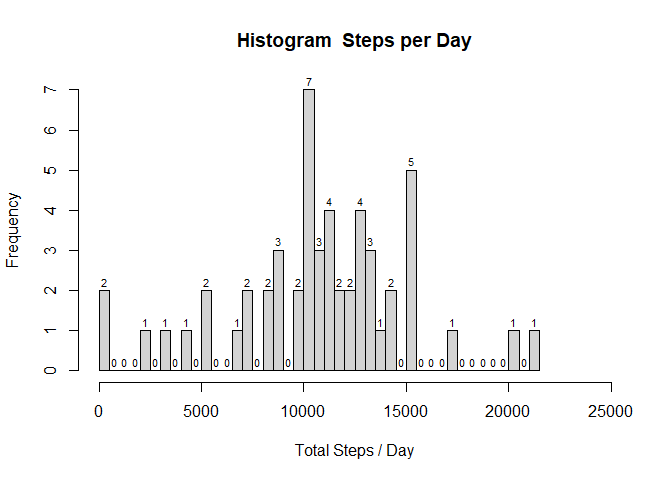
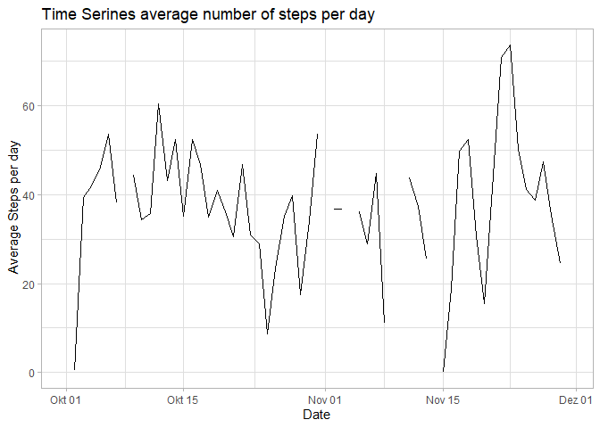
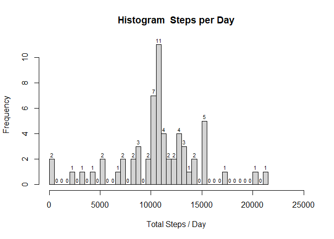
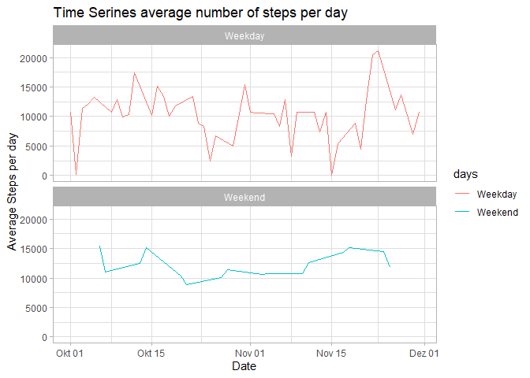

#### **Loading and preprocessing the data**

```r
library(ggplot2)
data <- read.csv("repdata_data_activity/activity.csv")
head(data)
```

```
##   steps       date interval
## 1    NA 2012-10-01        0
## 2    NA 2012-10-01        5
## 3    NA 2012-10-01       10
## 4    NA 2012-10-01       15
## 5    NA 2012-10-01       20
## 6    NA 2012-10-01       25
```

```r
str(data)
```

```
## 'data.frame':	17568 obs. of  3 variables:
##  $ steps   : int  NA NA NA NA NA NA NA NA NA NA ...
##  $ date    : chr  "2012-10-01" "2012-10-01" "2012-10-01" "2012-10-01" ...
##  $ interval: int  0 5 10 15 20 25 30 35 40 45 ...
```

```r
summary(data)
```

```
##      steps            date              interval     
##  Min.   :  0.00   Length:17568       Min.   :   0.0  
##  1st Qu.:  0.00   Class :character   1st Qu.: 588.8  
##  Median :  0.00   Mode  :character   Median :1177.5  
##  Mean   : 37.38                      Mean   :1177.5  
##  3rd Qu.: 12.00                      3rd Qu.:1766.2  
##  Max.   :806.00                      Max.   :2355.0  
##  NA's   :2304
```

```r
sum <- aggregate(data$steps, by = list(date = data$date), FUN = sum, ia.rm = TRUE)
sum$date <- as.Date(sum$date)
head(sum)
```

```
##         date     x
## 1 2012-10-01    NA
## 2 2012-10-02   127
## 3 2012-10-03 11353
## 4 2012-10-04 12117
## 5 2012-10-05 13295
## 6 2012-10-06 15421
```

```r
str(sum)
```

```
## 'data.frame':	61 obs. of  2 variables:
##  $ date: Date, format: "2012-10-01" "2012-10-02" ...
##  $ x   : int  NA 127 11353 12117 13295 15421 11016 NA 12812 9901 ...
```

```r
summary(sum)
```

```
##       date                  x        
##  Min.   :2012-10-01   Min.   :   42  
##  1st Qu.:2012-10-16   1st Qu.: 8842  
##  Median :2012-10-31   Median :10766  
##  Mean   :2012-10-31   Mean   :10767  
##  3rd Qu.:2012-11-15   3rd Qu.:13295  
##  Max.   :2012-11-30   Max.   :21195  
##                       NA's   :8
```

The dataframe (sum) includes the the total steps each day.

#### **What is mean total number of steps taken per day?**

```r
steps <- sum$x
h <- hist(
        steps,
        main = "Histogram  Steps per Day",
        breaks = 60,
        xlim = c(0, 25000),
        xlab = "Total Steps / Day"
)

text(
        h$mids,
        h$counts,
        labels = h$counts,
        adj = c(0.5,-0.5),
        cex = 0.7
)
```

<!-- -->


Calculation the **mean** value:


```r
mean <- round(mean(sum$x, na.rm = TRUE), digits = 0)
mean
```

```
## [1] 10767
```

**The mean value is 10767**
`

Calculation the **median** value:


```r
median <- (median(sum$x, na.rm = TRUE))
median
```

```
## [1] 10766
```

**The mean value is 10766**


#### **What is the average daily activity pattern?**


```r
mean <- aggregate(data$steps, by = list(date = data$date), FUN = mean, na.rm = TRUE)
mean$x <- round(mean$x, digits = 2)
mean$date <- as.Date(mean$date)
p <- ggplot(mean, (aes(date, x))) +
        geom_line() +
        labs(x = "Date", y = " Average Steps per day", title = "Time Serines average number of steps per day") +
        theme_light()

p
```

```
## Warning: Removed 2 row(s) containing missing values (geom_path).
```

<!-- -->


#### **Imputing missing values**


```r
CountNA <- sum(is.na(data$steps))
CountNA
```

```
## [1] 2304
```

The Total numbers of rows with NA is  2304


```r
data1 <- data
data1$steps[is.na(data1$steps)] <- mean(data1$steps, na.rm = TRUE)
head(data1)
```

```
##     steps       date interval
## 1 37.3826 2012-10-01        0
## 2 37.3826 2012-10-01        5
## 3 37.3826 2012-10-01       10
## 4 37.3826 2012-10-01       15
## 5 37.3826 2012-10-01       20
## 6 37.3826 2012-10-01       25
```

```r
summary(data1)
```

```
##      steps            date              interval     
##  Min.   :  0.00   Length:17568       Min.   :   0.0  
##  1st Qu.:  0.00   Class :character   1st Qu.: 588.8  
##  Median :  0.00   Mode  :character   Median :1177.5  
##  Mean   : 37.38                      Mean   :1177.5  
##  3rd Qu.: 37.38                      3rd Qu.:1766.2  
##  Max.   :806.00                      Max.   :2355.0
```

Filling the missing values with mean function


```r
sum1 <- aggregate(data1$steps, by = list(date = data1$date), FUN = sum, ia.rm = TRUE)
sum1$date <- as.Date(sum1$date)
head(sum1)
```

```
##         date        x
## 1 2012-10-01 10767.19
## 2 2012-10-02   127.00
## 3 2012-10-03 11353.00
## 4 2012-10-04 12117.00
## 5 2012-10-05 13295.00
## 6 2012-10-06 15421.00
```

```r
str(sum1)
```

```
## 'data.frame':	61 obs. of  2 variables:
##  $ date: Date, format: "2012-10-01" "2012-10-02" ...
##  $ x   : num  10767 127 11353 12117 13295 ...
```

```r
summary(sum1)
```

```
##       date                  x        
##  Min.   :2012-10-01   Min.   :   42  
##  1st Qu.:2012-10-16   1st Qu.: 9820  
##  Median :2012-10-31   Median :10767  
##  Mean   :2012-10-31   Mean   :10767  
##  3rd Qu.:2012-11-15   3rd Qu.:12812  
##  Max.   :2012-11-30   Max.   :21195
```

```r
steps <- sum1$x
h <- hist(
        steps,
        main = "Histogram  Steps per Day",
        breaks = 60,
        xlim = c(0, 25000),
        xlab = "Total Steps / Day"
)

text(
        h$mids,
        h$counts,
        labels = h$counts,
        adj = c(0.5,-0.5),
        cex = 0.7
)
```

<!-- -->


```r
meanValue <- round(mean(sum1$x), digits = 0)
meanValue
```

```
## [1] 10767
```

```r
medianValue <- round(median(sum1$x), digits = 0)
medianValue
```

```
## [1] 10767
```


`**The mean Value is 10767 and the median Value is 10767 **


#### **Are there differences in activity patterns between weekdays and weekends?**


```r
library(timeDate)

sumtest <- sum1
sumtest$days <- isWeekday(sumtest$date)

weekday <- subset(sumtest, sumtest$days == TRUE)
weekday$days <- "Weekday"

weekend <- subset(sumtest, sumtest$days == FALSE)
weekend$days <- "Weekend"

week <- rbind(weekday, weekend)

week <- week[order(week$date),]
week$date <- as.Date(week$date)

p <- ggplot(week, aes(date, x, color = days)) +
        geom_line() +
        labs(x = "Date", y = " Average Steps per day", title = "Time Serines average number of steps per day") +
        facet_wrap( ~ days, ncol = 1) +
        theme_light()
p
```

<!-- -->

